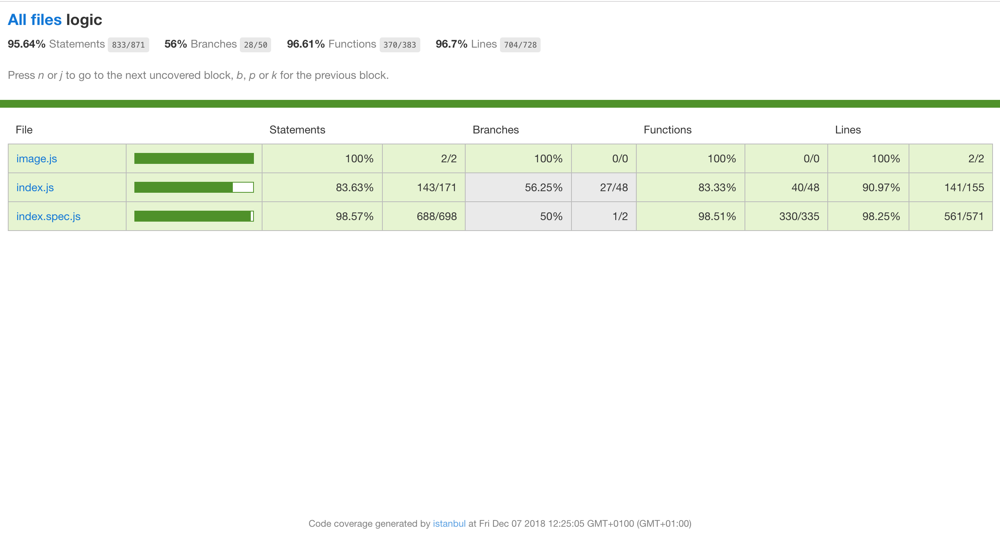

# PARTYUP

### **INTRODUCTION**

####  **The project.**

This full-stack project was developed for the Skylab Coders bootcamp with the objective of apply the following technologies and methodologies in a real life application:

+ Javascript (ECMAScript2016)
+ ReactJS
+ React Router
+ NodeJS
+ CSS
+ Sass
+ BEM
+ Mongo
+ Mongoose
+ Claudinary

---

####  **What is Partyup?**

Friday night at home and without plans? **Partyup is the solution.**

*Looking for city or tag, you can find events or plans of your interest, see where and who will assist and comment some doubt about the event.*

*But if you have the plan but not the people, you can post your event and people interested in it can join you!*

---

### **INSTRUCTIONS**

For launch, in each folder (Partyup-app and Partyup-api)

> $ npm i

> $ npm yarn start

---

### **DOCUMENTATION**

On the **landing**, the user can see the next 3 events that will be in the country. Can **Register** or **Login**.

If the user wants filter for some **city** or **tags**, you must login. After that, the user will be on the **home**. Here can find and enter inside the events that will appear. 

In every **partyup**, can read the description, date, place and the host. The user can confirm the **assistance** or anulate it, **delete** the partyup (just if is the host).

Can make some **commentary** about the event. 

Is possible see who will assist to event and check his **public profile**, where will show his information and the partyup’s created and with assist.

“Por defecto” the user have a user avatar that can change in the **profile**. Profile is similar to Public profile, with the diference that if you desire **delete your profile**, or **upload a new avatar**, you can do it.

At least, you can **create a partyup**, writing the title, description, and other information. If you desire, you can upload a image of the event.

#### **USE CASES DIAGRAM**

#### **FLOW DIAGRAM**

#### **ACTIVITY DIAGRAM**

---

### **TECHNICAL DESCRIPTION**

The front-end part of the application was built using ReactJS. 

The back-end, built using NodeJS, is connected with Partyup-data for manage the information in mongoose. 

#### **BLOCK DIAGRAM**

#### **COMPONENT DIAGRAM**

#### **DATA MODEL**
Partyup-data is composed of 3 schemas: User, Partyup and Commentary, relationated each other in this way: 

#### **TEST COVERAGE**

---

### **LIVE DEMOS**

[Partyup responsive web](URL "Título del enlace")

---

### **AUTHOR**
Daniel Villegas Ortiz
