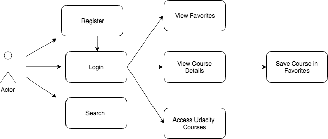
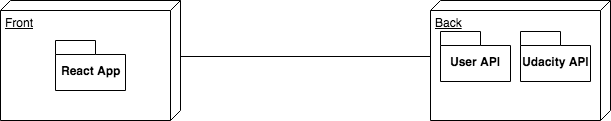
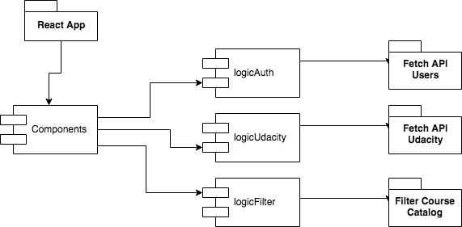
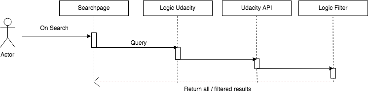

# SkyTuts

## Intro
--------

This is an aplication which allows the user to browse through the Udacity course catalog, to favorite courses and to access them by being redirected to the official Udacity website. 

## Functional description
--------

The SkyTuts App helps the user navigate through the vast catalog offered by the Udacity website in an user-friendly manner. Once registered and logged in, the users may read detailed information about the courses and add them to their Favorites collection.

## Technical description
-----
SkyTuts is a web application meant to run within a browser environment. It consists of a ReactJS frontend that connects to two APIs:
A User API that handles user registration and login and also stores user data,
and the Udacity public API, used to browse the platform's catalog.

The application is written in ReactJS and almost every component has been refactored using the PUG syntax for brevity and clarity.

The application's logic has been tested with the Mocha and Chai frameworks.

## Functional Diagram

## Blocks

## Components

## Sequences

