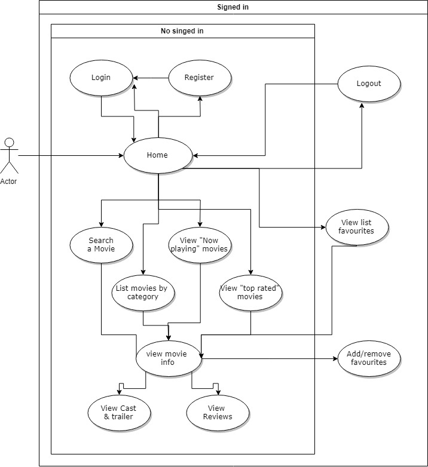
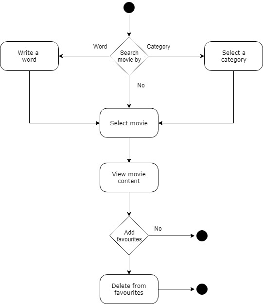
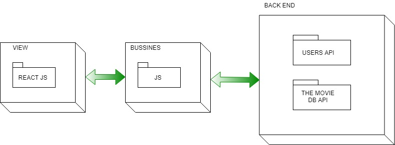
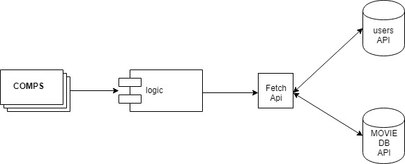
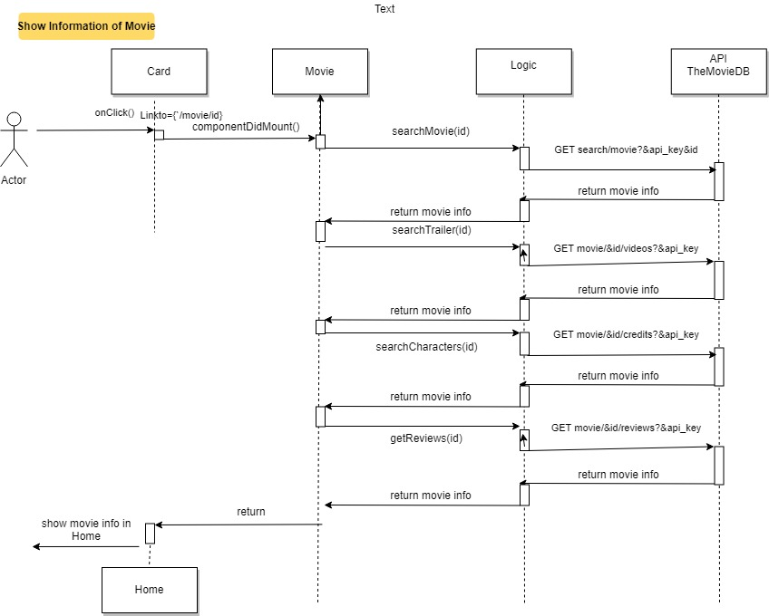
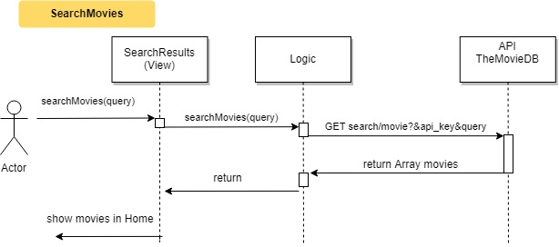
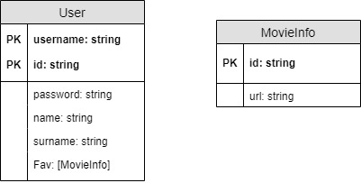
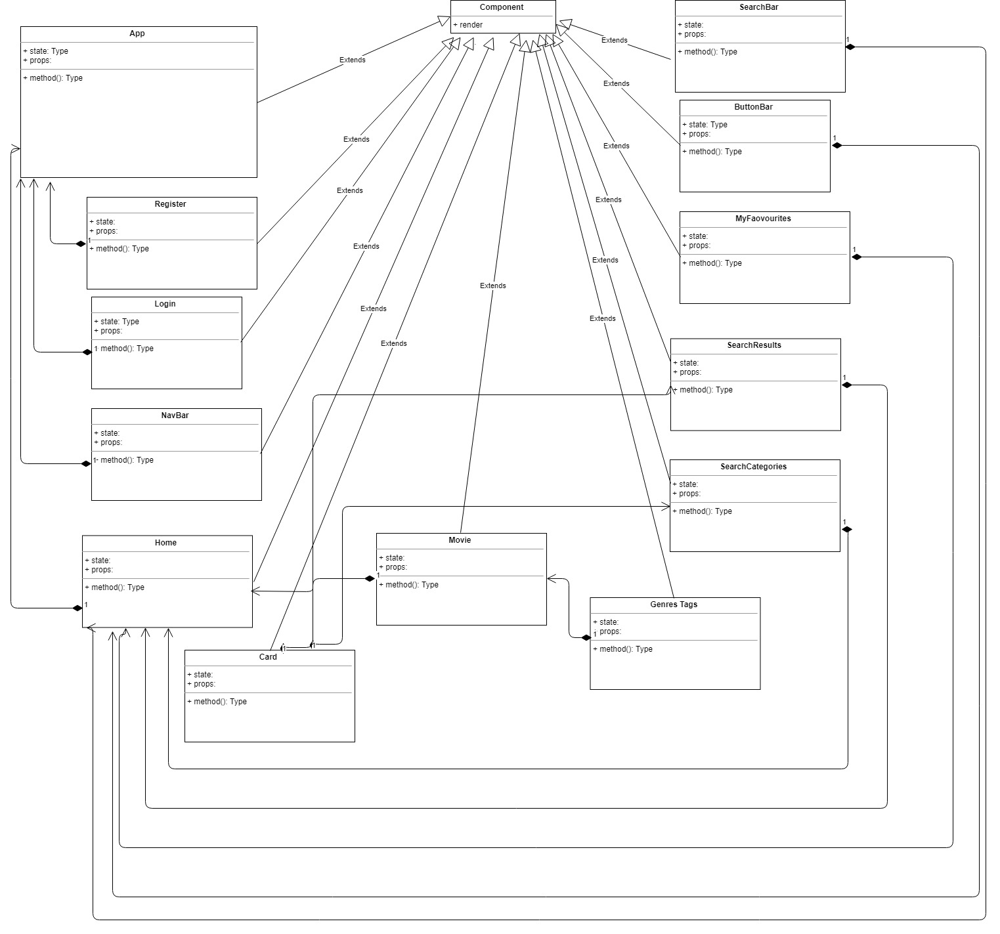

# GAMMA FILMS documentation

## Intro

This application is designed for movie lovers, who can access a huge database. They can find all kinds of information about films, create a list of favorite movies and see comments from other movie lovers.

# Functional description

## Use Cases Diagram

## Activity Diagram

# Technical description
The front end of the application was built using React and React Router. As a database, we use The movie DB. A fantastic database of movies and series, completely updated and in diferents languages.

## Blocks Diagram

## Components Diagram

## Sequences Diagram

## Data Model Diagram

 

## Class Diagram

 

## Group components

- Sergio (admin) [Sergioluz90](https://github.com/sergioluz90)
- Paco [Pacoscript](https://github.com/Pacoscript)
- Lluís [LluisBagur](https://github.com/LluisBagur)
