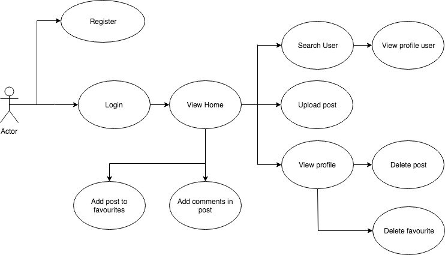
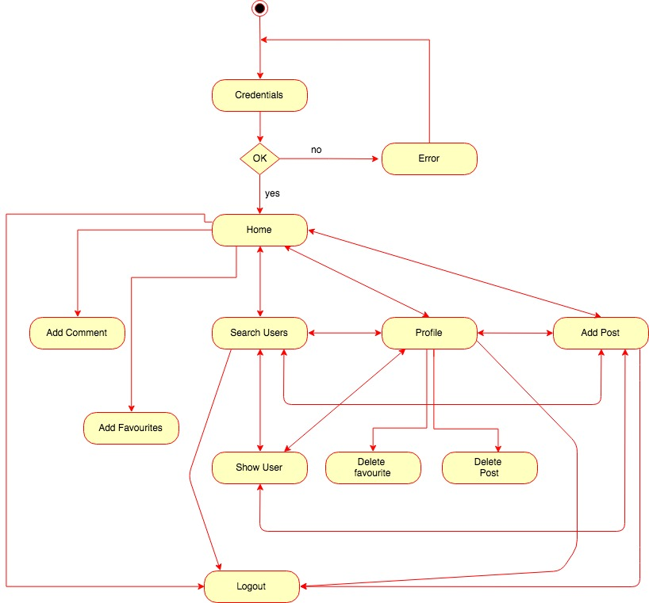
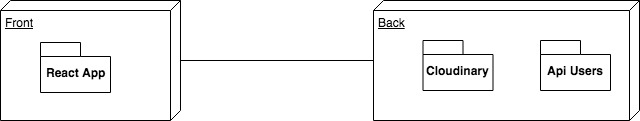
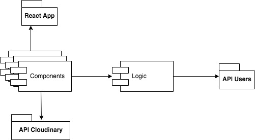
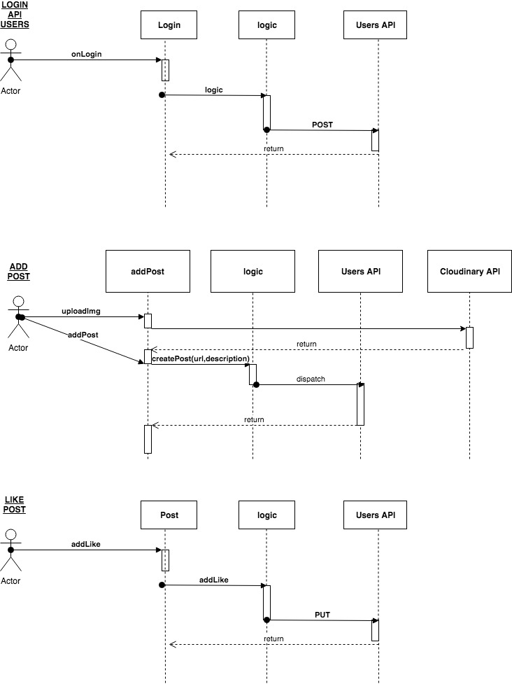
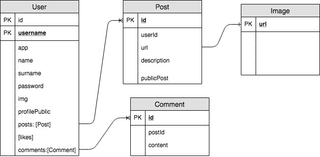
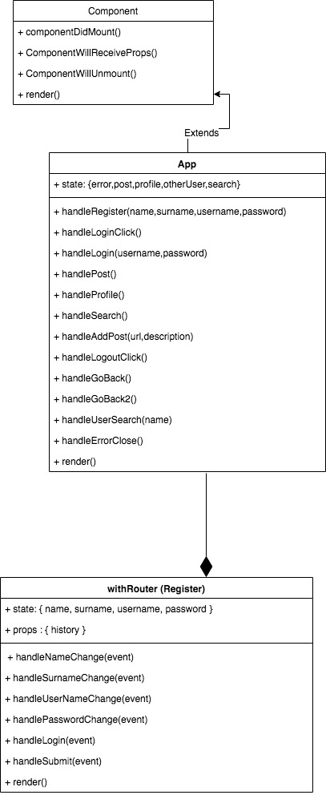

# Pintegram App

## Intro 
This app is a basic simulation of a social media app.

## 1. Functional description

The "Pintegram App" allows the user to upload an image via the cloudinary api and interact with other images other users have uploaded. Once registered and logged in, the user is sent to the **home** page. In the home page, the user is presented with all the images uploaded from other users in chronological order(most recent first).
The user may either favourite or comment an image.

The app also has a navigation bar present in all the different pages. In the navigation bar, the user may:
  + navigate back to home page by clicking on the word **Pintegram** or the logo.
  + search for a user to view their profile
  + upload an image
  + logout

In the **profile** page, the user views his/her profile image and his/her posts, as well as the images that have been favourited from other users.
The user may delete his/her posts and unfavourite other images.

## Use cases

## Activity Diagram

## 2. Technical description

The application is a web application meant to run within a browser environment. In consists of ReactJS that connects with two APIs:

+ a "user API that handles user registration and login, as well as storing profile data

+ the Cloudinary API for storing user profile images and uploading images for posts.

The application is written in Javascript and takes advantage of ES6.

User data and public data from other users is consistent across the app and as the page reloads and switches pages. Local login data is stored in Session Storage and consistent requests to the API are made to ensure consistent data is always present.

## Blocks

## Components

## Sequences

## Model Diagram

## Classes Diagram

