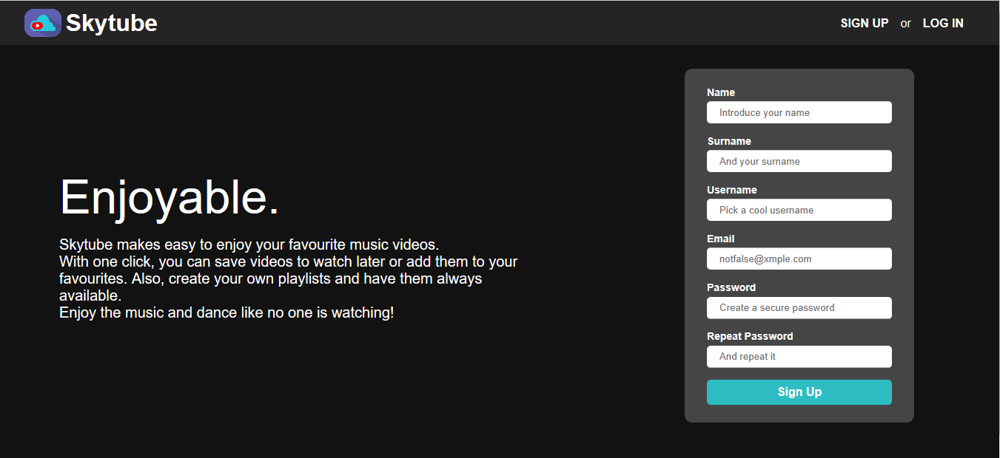
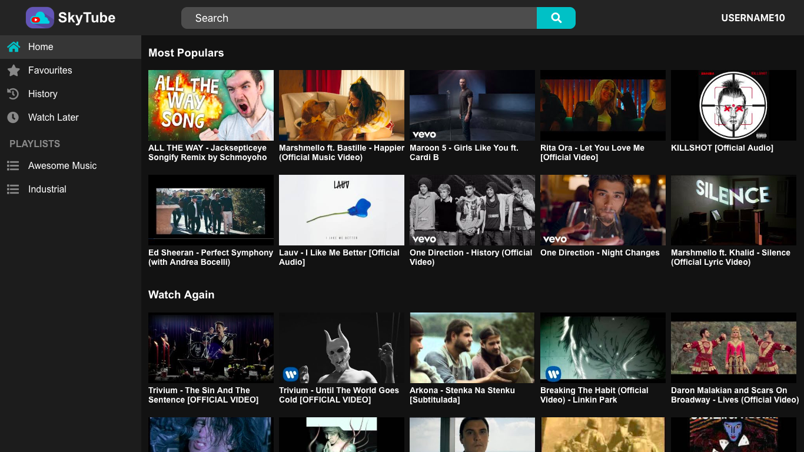
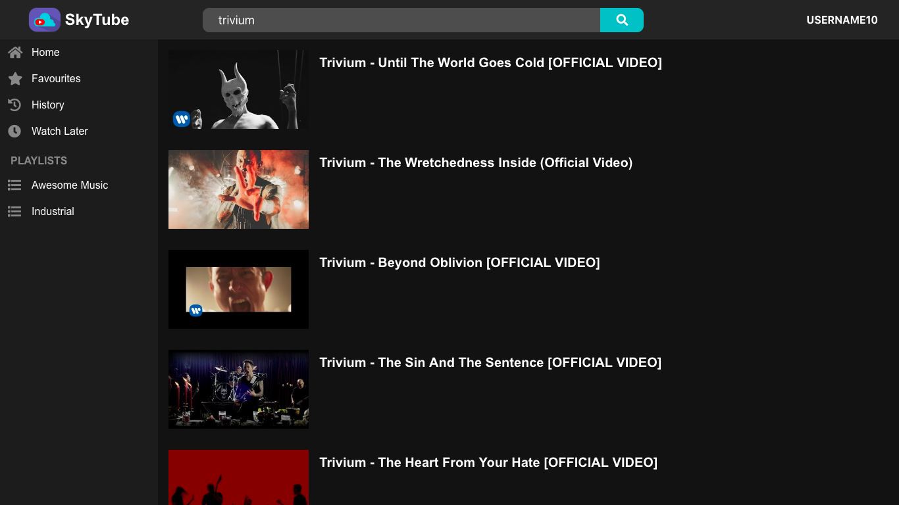
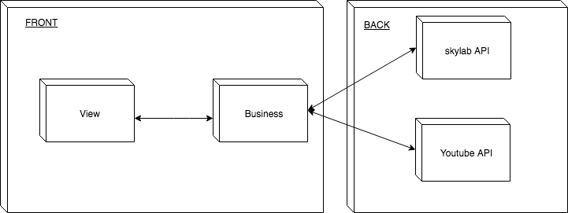
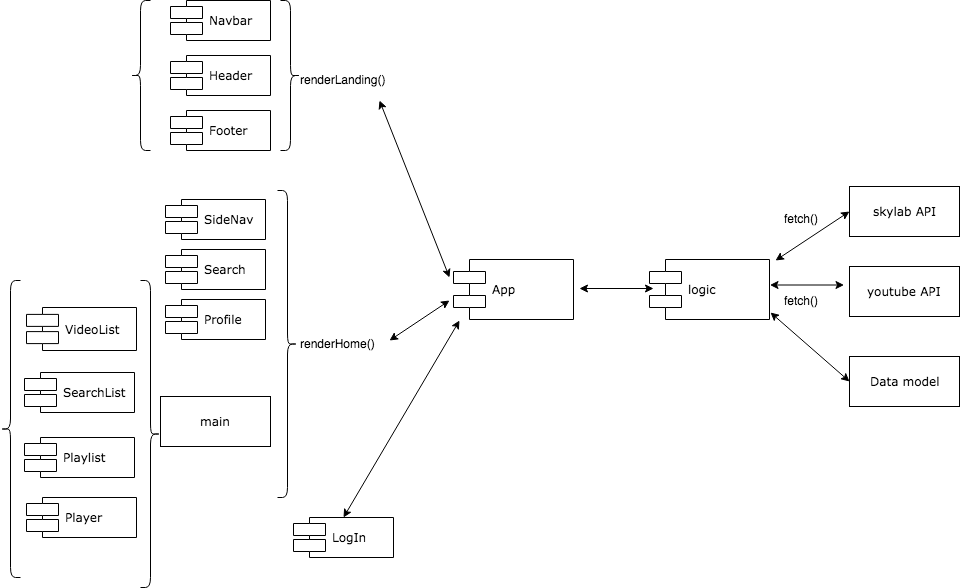
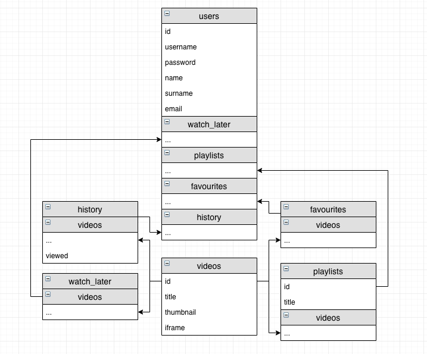

# **Skytube**

## **Introduction**

#### *Skytube makes easy to enjoy your favourite music videos.* 
#### *With one click, you can save videos to watch later or add them to your favourites. Also, create your own playlists and have them always available.*
#### *Enjoy the music and dance like no one is watching!*

## **Functional description**

When the user enter on the **landing**, can make a new **register** or **log in** with a existent user.

After the authentication, the user will be redirect to the **home** section. Here, the user  will see two sections, the **most popular** music videos and **watch again**. 

On the top of home, the user can **search** new music videos. 

And then select from the **retrieved list** one video for visualitzation (the **player**).

When watching a video is possible to add them to **favourites**, **watch later** or create a new **playlist**. Later you can acces them from the sidevar.

The user can see the **user** information clicking on the button on the top rigth of the screen. 

Here, appart from the **username** and **email**, can find the **log out** button and come back to the **login** page.

### *Use case diagram*

## **Tecnical description**

### *Block diagram*

### *Component diagram*

### *Data model diagram*

