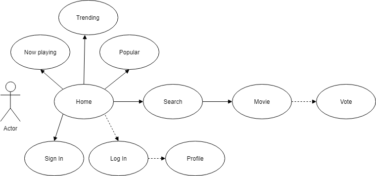
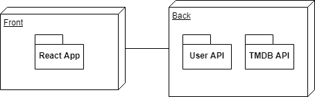
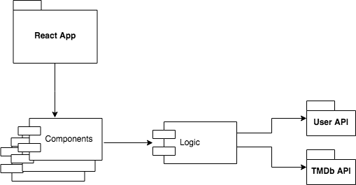
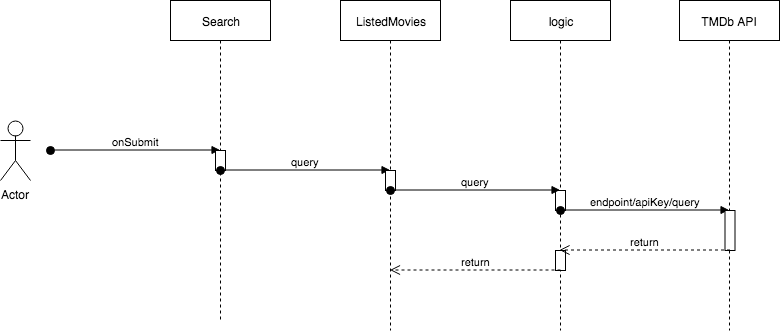
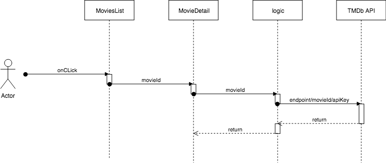
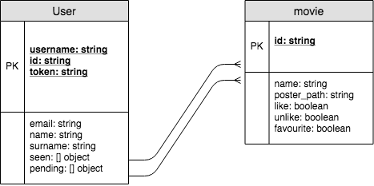

# Skylab Movie Database App

## Intro

The objective of this application is to allow users to search movies in a big database and show the most important infomation about movies. It allso allows to add movies in lists and tag them as favourite and like or unlike.

## Functional description

With SMDb every user is able to find the considered trending and popular movies and the ones that are in cinemas at the moment. The app also offers the possibilitie of searching movies by title coincidence. Once the user clicks on one movie image, some of the most relevant details of that film appear, such as the duration, the language, the overview and the cast. 

If the user is registered and logged he also has the possibilitie to add the movie in his own seen movies list or pending movies list. If he adds it in the seen movies list, he is able to add the favourite tag and the like or unlike tag to the movie. In the same way, he can click again to that buttons to delete the movie from the lists or to take out the tags. 

The registered and logged user can acces from the user picture menu (top-right of the menu) to his information, the one that he added in the moment of the registration, and to his movies lists. From his movies lists page he can also acces to the detailed movie information by clicking to each movie picture.   

### Use Cases diagram

## Technical description

SMDb is designed as desktop first application, but responsive and as a web application should be runned in a browser. It's created using React.js in the frontend and interacting with two appis in the backend, The Movie Database API and Skylab User API. 

The app is written in javascript language,using some features of javascript ES 6. It also uses SessionStorage to maintain the user logged even a reload occurs. 

The design is implemented using the library of Bootstrap 4, jQuery, Popper and Slick. 

### Block diagram

### Components diagram

### Sequence diagram

#### - Search

#### - Movie details

### Data Model diagram

