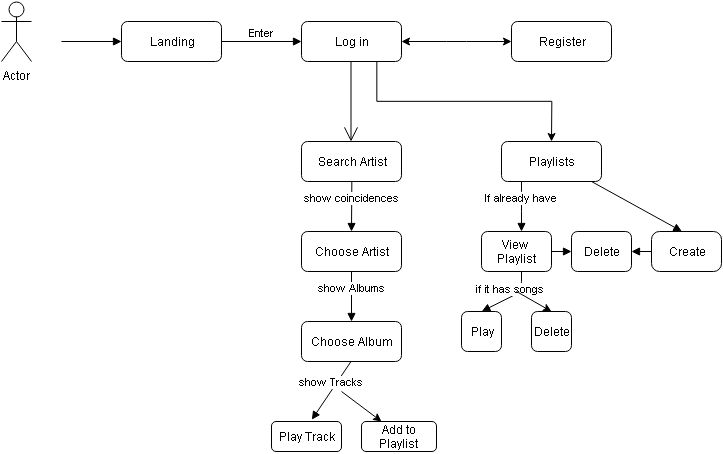
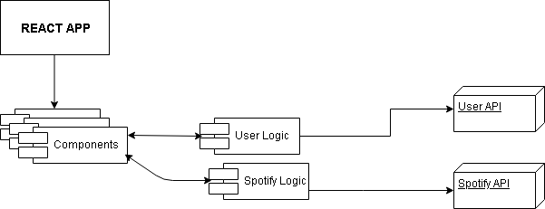

# MusicLab App

# Functional Description

## Use dases diagram

The first thing the user can see is the landing page with the logo a quote and an enter button. After clicking on the Enter button, the user can see the rotation cube where all the sides have different functionalities.  

It's possible to register, log in, see the saved playlist, if the user has, search an artist, choose an album, choose a track and play it, add it to an existing playlist:

 
 

***

# Technical Description  

## Components Diagram  

Our application has some react components, the business logic and two APIs that we use: UserAPi (to store and access all the users data) and SpotifyAPI (to access all the artists, albums and tracks details that we show to the user):

 

***

# Sequence Diagram  

There are some repetitive tasks in our logic the most significant of them are those that use the APIs. The User API is used to save the user data when registering, and to authenticate the data of the saved user with the data introduced in the login; the authentication process of the data in the login looks like this:  

