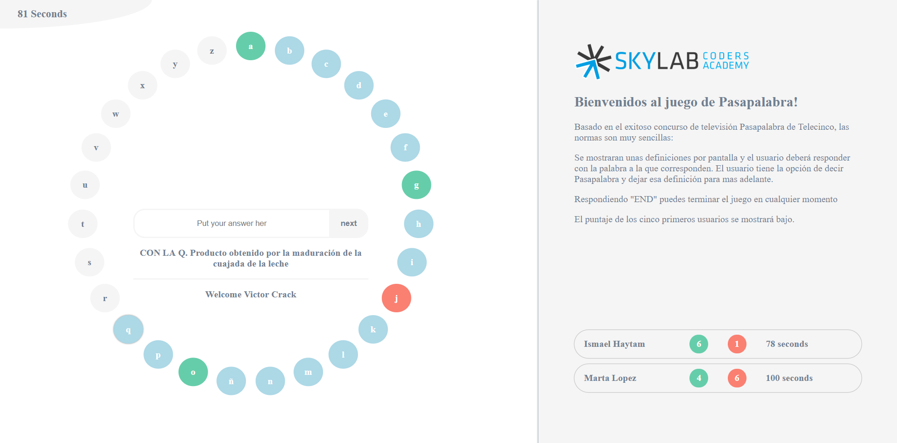

# Project: Pasapalabra++

The game consists of hitting the twenty-seven words, the correct answers will be reflected in the letters by the color green, while the failures will be shown in red. Unanswered questions or "paspalabra" will be displayed in blue.
To complete the game you have a certain time.

**To play open the index.html, you will find more instructions in the game**

[**Project: Calculator**]

