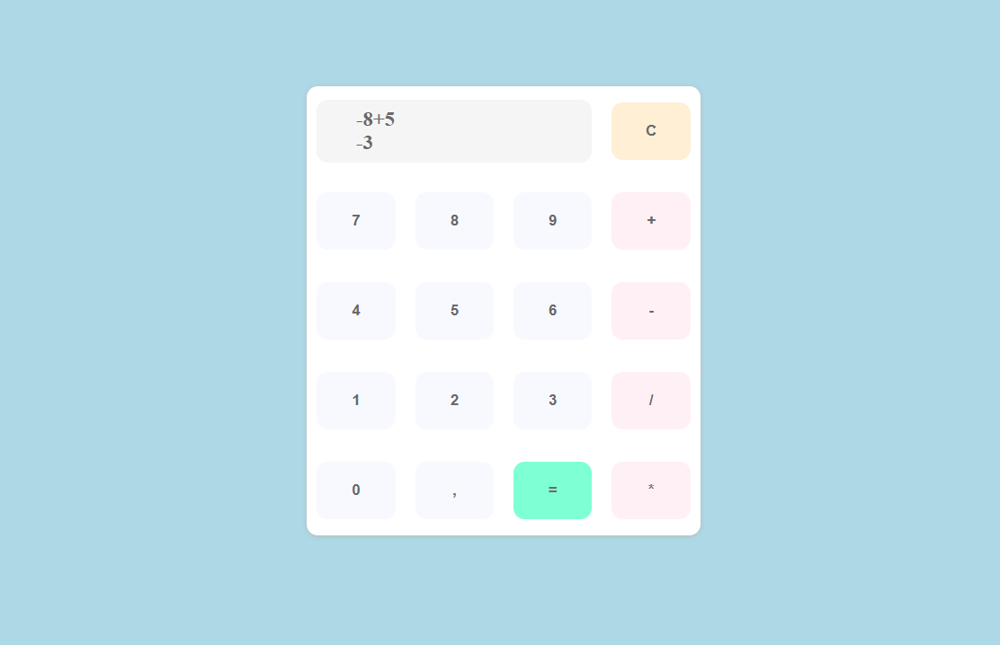

### Pre-curse / Skylab Coders

****

Welcome to the pre-course of SkylabCoders, here you will find all the statements, exercises and challenges that will help you to learn to master the basic structure of Javascript, HTML and CSS.

The objectives of the pre-course are:

- Prepare to start the course with **a good level of Javascript**
- Understand the global vision of **communication between layers** (JS / HTML / CSS)
- Inculcate **good practices** regarding code and work organization.

(Estimated time: 70 hours)

****

| Lesson                     | Exercises    | Project       | 
| ---------------------------|:------------:|:-------------:|
|   1 - Methods              | 33           | Calculator    |
|   2 - Objects              | 20           | Airline       |
|   3 - Functions            | 20           | Bingo         |
|   4   Challenges           | 24           | Pasapalabra   |
|   5   HTML                 | .            | .             |
|   6   CSS                  | .            | .             |
|   7   JS-NATIVE/HTML/CSS   | .            | Calculator++  |
|   8   Final Project        | .            | Pasapalabra++ |

***

[**Project: Pasapalabra**]

[**Project: Calculator**]

