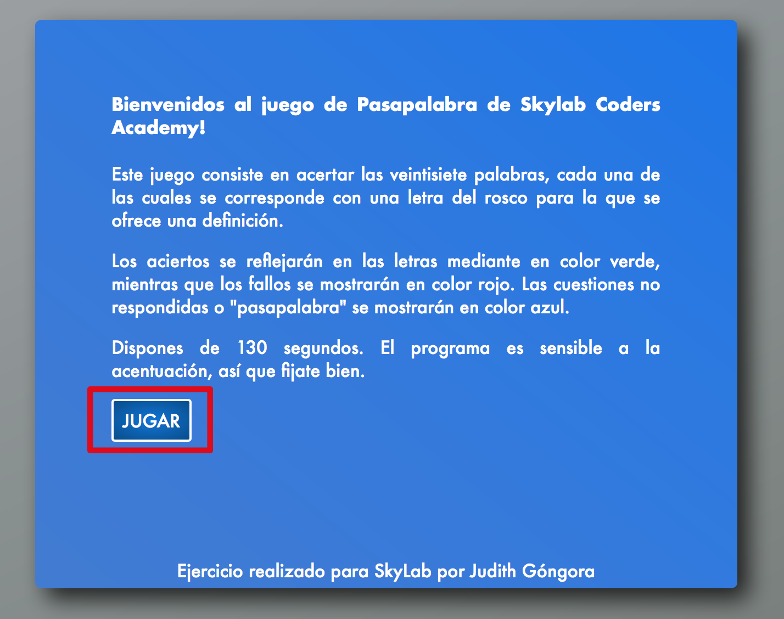
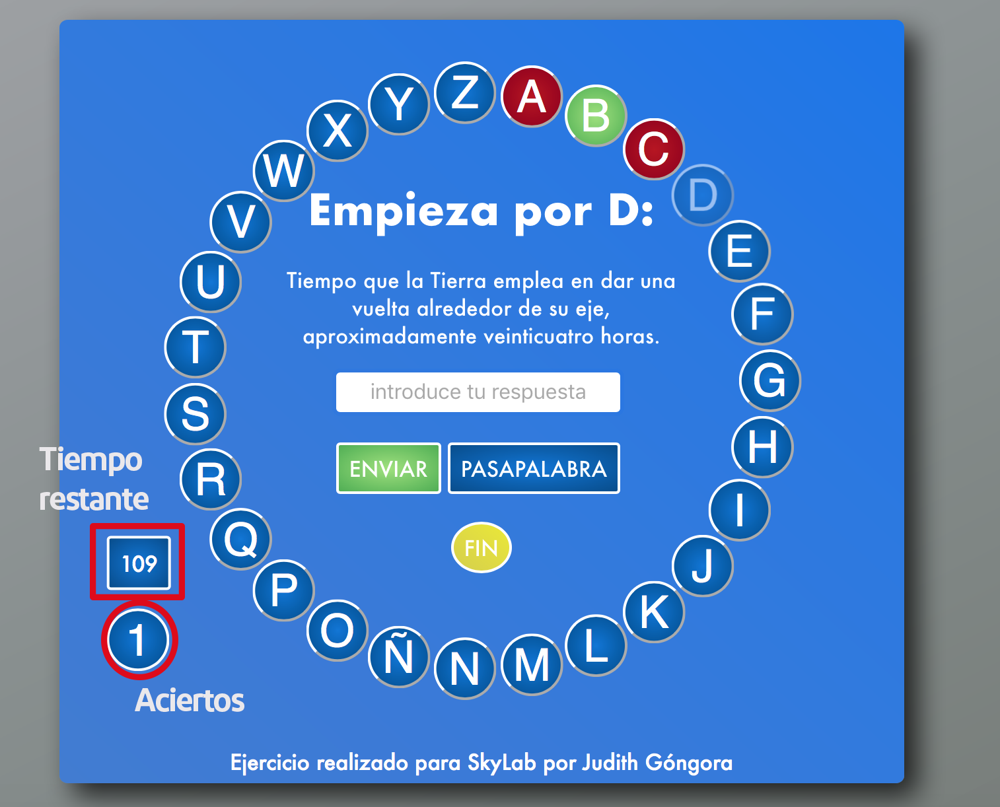

# Documentation - Pasapalabra

Welcome to Pasapalabra of Skylab Coders Academy!

This game consists of matching the twenty-seven words, each of which corresponds to a letter of the rosco for which a definition is offered.

Successes will be reflected in the letters in green, while failures will be shown in red. Unanswered questions or "wordpassword" will be displayed in blue.

You have 130 seconds. The program is sensitive to accentuation, so look good.

To start playing you must press the PLAY button that appears when loading the page.

The game is visualized like this.

You have a section where you can see the remaining time of your game and a hit counter.

[Try Pasapalabra](index.html)